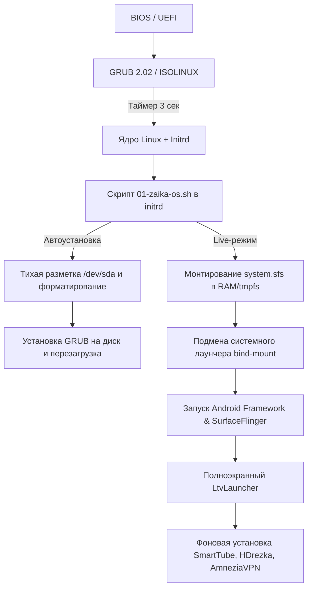

# Архитектурный план реализации «Зайка ОС»

## 1. Архитектурная база
- **Базовый дистрибутив:** PrimeOS Classic 0.4.5 (на базе Android-x86 7.1.2 Nougat, Linux Kernel 4.9 LTS с открытыми драйверами `radeon` / `radeonsi`).
- **Формат поставки:**
  - Загрузочный гибридный ISO-образ (поддержка BIOS MBR и UEFI x86_64).
  - Загрузочная USB-флешка с разделами FAT32 / ext4.

## 2. Модификация цепочки загрузки

## 3. Компоненты системы
1. **Слой Initrd (`initrd.img`):**
   - Перехват управления через `/scripts/01-zaika-os.sh`.
   - Внедрение скриптов автоматической разметки через `parted`/`sfdisk`/`mkfs.ext4`.
   - Настройка точки монтирования системных приложений (`/system/priv-app`).
2. **Слой пользовательского окружения (`zaika_setup.sh`):**
   - Управление начальной инициализацией Android (`settings put system system_locales ru-RU`).
   - Настройка скрытия строки состояния и навигационной панели для полного экрана.
   - Фоновая установка вспомогательных медиа-пакетов.
3. **Брендинг:**
   - Подмена анимации загрузки в `/system/media/bootanimation.zip`.
   - Стилизация меню GRUB (`splash.png`, `theme.txt`).

## 4. Этапы разработки
- [x] **Этап 1:** Анализ аппаратной совместимости с AMD E-450 и выбор базового образа PrimeOS Classic.
- [x] **Этап 2:** Настройка GRUB и автоматического скрипта установки на `/dev/sda`.
- [x] **Этап 3:** Создание минималистичной покадровой boot-анимации с зайчиком и морковкой.
- [x] **Этап 4:** Подготовка APK-пакетов (LtvLauncher, SmartTube, HDrezka, AmneziaVPN).
- [x] **Этап 5:** Тестирование Live-образа в VirtualBox и выявление узких мест (задержка dex2oat).
- [ ] **Этап 6:** Реализация мгновенного запуска LtvLauncher через priv-app и устранение экрана «Запуск Android».
- [ ] **Этап 7:** Проверка чистой автоустановки на физическом неттопе с одной мышью.
